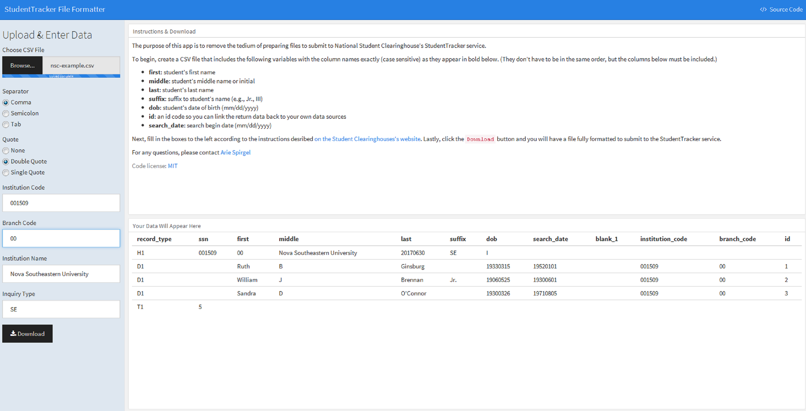

# nscprepr app

The code here is a companion to the `nscprepr` package (https://github.com/spirgel/nscprepr). It creates a shiny app with a graphical user interface that allows users to easily format files for submission to the National Student Clearinghouse's StudentTracker service. If you decide to deploy the app to the web, please be cognizant of what happens to data that is uploaded (e.g., based on their terms of use, your IT team would probably recommend against shinyapps.io).

The screenshot below shows how the app looks when it is run.

